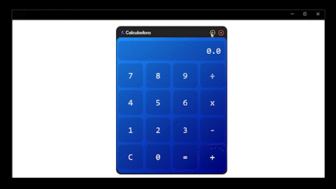

<h1> Como funciona? </h1>

Interface gráfica de uma calculadora desenvolvida em JavaFX que permite realizar operações matemáticas básicas, como adição (+), subtração (-), multiplicação(*) e divisão(/). Além de ser composta por botões numéricos, botões de operações, além de botões para minimizar e fechar a janela. 
  
 
  
O resultado da operação será exibido na área de exibição da calculadora. Além das operações básicas, a calculadora também possui um botão de "limpar" (C) que permite redefinir todos os valores e reiniciar os cálculos. Isso é útil quando você deseja realizar uma nova operação sem utilizar os valores anteriores. 

O botão de minimizar permite reduzir a janela da calculadora para que ela fique em segundo plano, enquanto o botão de fechar encerra a aplicação. Para realizar uma operação, basta clicar nos botões numéricos para inserir os valores desejados e, em seguida, clicar no botão correspondente à operação desejada. 
</>

<h2> Tecnologia(s) usadas: </h2>
    <h4> 
      

       
       Java
       

   </h4>

